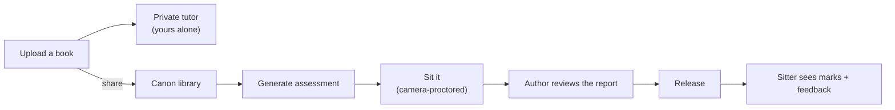

# Kitaably

**A study platform built on the books its users actually work from.**


You upload the books you are studying from. They become **(a)** a tutor you can
question — a private upload answers only to its owner — and **(b)**, once you share
them, a source for auto-generated assessments, sat under camera-based proctoring, with
the assessment's author reviewing the report before it reaches the person who sat it.



There is **one kind of account**. Everyone can upload, share, author an assessment, and
sit one — see [`docs/DECISIONS.md`](docs/DECISIONS.md) D16 for why roles and classrooms
were removed, and what that cost.

Design and rationale live in [`docs/`](docs/); the invariants that must not be traded
away live in [`CLAUDE.md`](CLAUDE.md).

---

## Where it stands

Phases 0–6 are built and were driven end to end in a browser against a live database:
sign-up, sign-in, password recovery, upload, share, grounded cited chat, assessment
generation and sitting. Phase 7 is underway in the working tree.

| Phase | What | Status |
|:-:|---|:-:|
| 0 | Skeleton and local platform | done |
| 1 | Identity | done |
| 2 | The sharing boundary | done |
| 3 | Ingestion and the scoping boundary | done |
| 4 | Grounded chat | done |
| 5 | Assessment generation | done |
| 6 | Taking an assessment, unproctored | done |
| 7 | **Proctoring capture** | in progress |
| 8 | The review gate | next |
| 9 | Kubernetes | started — flat manifests in [`infra/k8s/`](infra/k8s/) |
| 10 | Terraform and continuous delivery | planned |
| 11 | Observability and hardening | planned |

Full detail, exit criteria, and the two-track (Ship / Learn) breakdown per phase live in
[`docs/ROADMAP.md`](docs/ROADMAP.md).

**Phase 7 so far:** the exam runner opens a camera session with consent, runs a
MediaPipe loop with debounced heuristics, batches observations with heartbeats, uploads
evidence stills for high-severity events, and the server recomputes severity and an
integrity score from those events rather than trusting the client. The author gets a
read-only report beside the marks — Phase 8 adds the per-event dismiss/uphold actions
that turn that report into something releasable.

Seeded accounts, loaded automatically on first start: `amina@kitaably.test` and
`ravi@kitaably.test`, password `Passw0rd!123`. Two of them, because the property worth
checking by eye is that one cannot see the other's personal books.

---

## Running it

One stack. Supabase is in compose alongside everything else
([`docs/DECISIONS.md`](docs/DECISIONS.md) D33), and the migrations, buckets and seed run
themselves.

```bash
cp .env.example .env       # the local keys are already in it
make setup-llm             # the dev LLM, once -- onto the HOST, not a container
docker compose up --build  # everything
```

First start applies 29 migrations, creates the two private buckets and seeds the
accounts above before the backend accepts a request; it takes a few minutes. Every step
is idempotent, so `up` is safe to repeat. `make migrate` applies new migrations without
touching data; `make db-reset` rebuilds from scratch and **deletes every book**.

| Service | URL |
|---|---|
| Frontend | http://localhost:3000 |
| Backend docs | http://localhost:8000/docs |
| Backend readiness | http://localhost:8000/ready |
| Embeddings | http://localhost:8001/health |
| Supabase Studio | http://localhost:54323 |
| Supabase API | http://localhost:54321 |
| Ollama | http://localhost:11434 |

`make help` lists every target. To work outside containers: `make sync`, then
`make dev-backend`, `make dev-embeddings`, `make dev-frontend`.

Requires the [Supabase CLI](https://supabase.com/docs/guides/local-development), Docker,
`uv`, and Node 20+. The backend answers `/health` without Supabase running; `/ready`
reports `degraded` until Postgres is up, which is the correct behaviour and worth seeing
once.

---

## Stack

| Layer | Choice |
|---|---|
| Frontend | Next.js App Router, TypeScript, Tailwind v4 |
| Backend | FastAPI, Python 3.12, async SQLAlchemy 2.x |
| Relational + vectors | Supabase Postgres + `pgvector` — one database |
| Auth | Supabase Auth (JWT via JWKS); identity from `profiles`, never a claim |
| Storage | Supabase Storage; private buckets `books`, `evidence` |
| Queue | Redis + Celery + beat — `ingest`, `llm`, `proctor`, `maintenance` |
| Embeddings | `bge-small-en-v1.5`, CPU, separate service over HTTP |
| LLM | OpenAI-compatible client — Ollama in dev, OpenAI in deploy |
| Proctoring | MediaPipe, browser-side; server aggregates and scores |
| Deploy | EKS, Kustomize base + overlays, Terraform, GitHub Actions |

Fixed by `.env.example`; treat as decided. Rationale and reversal cost per choice live
in [`docs/DECISIONS.md`](docs/DECISIONS.md) — read it before overturning anything.

---

## The tree

<details>
<summary>Expand the full layout</summary>

```
.
├── backend/                    FastAPI API + Celery workers — one image, two roles
│   ├── app/
│   │   ├── main.py             app wiring: logging, middleware, CORS, handlers, routers
│   │   ├── core/
│   │   │   ├── config.py       pydantic Settings — the one place env is read
│   │   │   ├── logging.py      JSON logs + the request_id carried through the request
│   │   │   ├── errors.py       DomainError hierarchy + the single HTTP mapping
│   │   │   ├── metrics.py      Prometheus registry
│   │   │   ├── middleware.py   request id, access log, latency histogram
│   │   │   ├── security.py     JWT verification vs JWKS; the Principal
│   │   │   └── deps.py         auth guards — require_auth, require_book_owner, …
│   │   ├── db/
│   │   │   ├── base.py         DeclarativeBase + shared mixins
│   │   │   ├── session.py      async engine; request-path vs worker-path sessions
│   │   │   └── models/         SQLAlchemy models mirroring supabase/migrations/
│   │   ├── schemas/            Pydantic Create / Update / Read contracts
│   │   ├── api/
│   │   │   ├── health.py       /health, /ready, /metrics  (unversioned)
│   │   │   ├── router.py       the /api/v1 aggregator
│   │   │   └── v1/             one router per resource
│   │   ├── services/           business logic — where decisions live
│   │   ├── rag/
│   │   │   ├── parse.py        per-format parsers behind one registry
│   │   │   ├── chunk.py        chapter detection and chunking
│   │   │   ├── embed.py        batched calls to the embeddings service
│   │   │   ├── retrieve.py     ← build_retrieval_filter(): THE scoping chokepoint
│   │   │   ├── shape.py        what shape of retrieval a question needs
│   │   │   ├── rank.py         post-retrieval ranking — pure, and can only discard
│   │   │   ├── brief.py        turns the author's one-line brief into decisions
│   │   │   ├── harvest.py      lifts the questions a book already asks
│   │   │   ├── formats.py      the format registry — one entry since D32
│   │   │   └── prompts.py      grounding + observation-not-accusation contracts
│   │   ├── clients/            outbound: embeddings, llm, storage — one file each
│   │   └── workers/
│   │       ├── celery_app.py   four named queues + the beat schedule
│   │       └── tasks/          thin wrappers over services; idempotent
│   ├── tests/                  test_scoping.py is the phase-3 exit criteria
│   ├── Dockerfile              multi-stage, non-root; API and worker share it
│   └── pyproject.toml
│
├── embeddings/                 standalone CPU embedding service (bge-small-en-v1.5)
│   ├── app/
│   │   ├── main.py             /health, /ready, /metrics, POST /embed
│   │   ├── model.py            ONNX load + encode off the event loop
│   │   ├── schemas.py
│   │   └── config.py
│   ├── Dockerfile              weights are NOT baked in — they land in a volume
│   └── pyproject.toml
│
├── frontend/                   Next.js App Router, TypeScript, Tailwind v4
│   ├── app/
│   │   ├── page.tsx            landing — the product loop, told step by step
│   │   ├── (auth)/             /login, /signup, /forgot-password, /reset-password
│   │   ├── (app)/              dashboard, books, chat, assessments — one shell
│   │   ├── attempt/[id]/       the runner and its result — outside the shell, by design
│   │   ├── exam/[token]/       share-link entry; the token grants access to attempt
│   │   ├── auth/callback/      spends emailed one-shot links server-side (D18)
│   │   └── api/backend/        the per-request proxy hop to the backend
│   ├── components/             glass primitives + reveal, site-nav, book-list,
│   │                           chat-panel, exam-runner, scope-chip —
│   │                           question-input.tsx: one renderer, keyed by type (D32)
│   ├── lib/
│   │   ├── api/                one typed client — no fetch calls in components
│   │   ├── proctoring/         camera + screen streams and the MediaPipe monitor
│   │   └── supabase/           browser, server, and session-refresh clients
│   ├── proxy.ts                refreshes the session cookie on every request
│   ├── next.config.ts          standalone output; proxy body-size headroom — the
│   │                           backend hop lives in app/api/backend/, per request
│   └── Dockerfile              standalone output; NEXT_PUBLIC_* are build args
│
├── supabase/                   ← the schema lives here
│   ├── config.toml             the local CLI stack
│   ├── migrations/             forward-only SQL; RLS ships with its table
│   └── seed.sql                test accounts and sample material
│
├── bruno/                      every endpoint, runnable — `bru run --env local -r`
│   ├── 00-auth … 08-cleanup/   numbered because each folder feeds the next
│   └── 07-boundaries/          nine requests that pass by being refused
│
├── infra/                      Phases 9–11
│   ├── k8s/                    Supabase stack + app services — flat manifests so far;
│   │                           the kustomize base/overlays split lands with Phase 9
│   ├── terraform/               modules/ + envs/{dev,prod}
│   └── monitoring/              prometheus rules, dashboards, runbooks
│
├── .github/workflows/          ci.yml, cd.yml, terraform.yml
├── docs/                       architecture, data model, roadmap, decisions, deployment
├── .claude/skills/              subsystem playbooks — read before touching that area
├── docker-compose.yml          the services this repo owns (not Supabase)
├── Makefile
└── .env.example
```

</details>

## Where the rules live

| Question | File |
|---|---|
| What must never be traded away | [`CLAUDE.md`](CLAUDE.md) |
| How a request flows, and across which trust boundaries | [`docs/ARCHITECTURE.md`](docs/ARCHITECTURE.md) |
| Tables, columns, enums, indexes, RLS intent | [`docs/DATA-MODEL.md`](docs/DATA-MODEL.md) |
| What to build next | [`docs/ROADMAP.md`](docs/ROADMAP.md) |
| Why it was built that way, and what reversal costs | [`docs/DECISIONS.md`](docs/DECISIONS.md) |
| Containers → Kubernetes → Terraform → CI → monitoring | [`docs/DEPLOYMENT.md`](docs/DEPLOYMENT.md) |
| How to add a route without inventing a new shape | [`.claude/skills/api-conventions`](.claude/skills/api-conventions/SKILL.md) |
| What every endpoint does, runnable | [`bruno/`](bruno/README.md) |

Four files carry more weight than their size suggests:

- [`backend/app/rag/retrieve.py`](backend/app/rag/retrieve.py) — the only place a
  predicate over `chunks` is built. A personal book stays personal because of this file.
- [`backend/app/core/deps.py`](backend/app/core/deps.py) — every route declares a guard
  from here. A route with no guard is a review failure.
- [`backend/tests/test_scoping.py`](backend/tests/test_scoping.py) — the cases that must
  pass before any scoping change merges. The one that matters most asserts that two
  users' filters are identical once their ids are masked: there is no account whose
  reach is wider, so there is no account to escalate into.
- [`backend/app/rag/formats.py`](backend/app/rag/formats.py) — the registry mapping each
  question format to the grading family that marks it. One entry since D32 cut fourteen
  formats to multiple choice alone, but the shape survives on purpose: format and family
  are checked against each other here and in a Postgres constraint, because a paper
  drawn as one thing and marked as another scores zero for everybody who sat it while
  looking completely normal.
